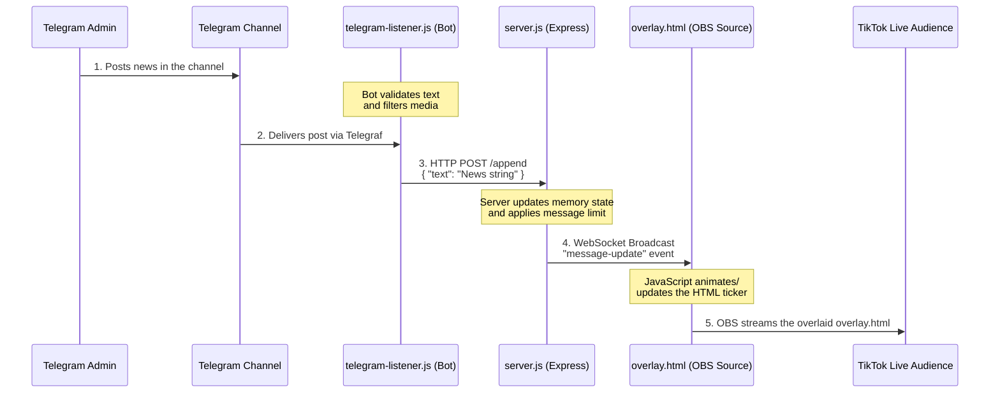

# TikTok Live News Architecture

Here is a visual presentation of how your setup works, from a message being posted on Telegram to it appearing on the TikTok Live stream.

## Component Breakdown

1. **Telegram Listener (`telegram-listener.js`)**
   - **Role:** Observes a specific Telegram channel for new text posts.
   - **Action:** Triggers when an admin posts something. It filters out images and media, extracts the first line of text, and sends it directly to your Express server using an encrypted HTTP request with an API key (`x-api-key`).

2. **Backend API & WebSockets (`server.js`)**
   - **Role:** The central hub holding the "state" (the active list of messages to display).
   - **Action:** 
     - Receives the message from the bot via the `/append` POST endpoint.
     - Maintains a configured limit (e.g., maximum 10 messages).
     - Instantly pushes the newly merged text to all connected clients over real-time WebSockets (Socket.io).
     - Also serves endpoints like `/limit` and `/messages` for external management.

3. **Frontend Overlay (`overlay.html`)**
   - **Role:** The visual component that actually goes over your broadcast.
   - **Action:** Connects to `server.js` dynamically using WebSockets. When the server pushes an update, the frontend updates its internal text container without needing a full page refresh. This is usually added as a "Browser Source" in broadcasting software like OBS or Streamlabs.

4. **TikTok Live (OBS / Streamlabs)**
   - **Role:** Distributes the overlay to your viewers.
   - **Action:** Captures the rendering of `overlay.html` and overlays it on your live video feed, broadcasting the combined picture to TikTok.
